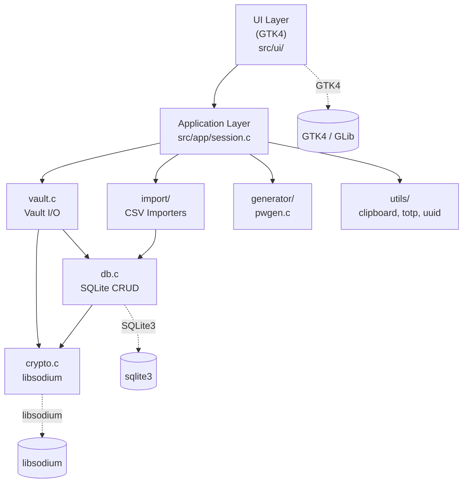
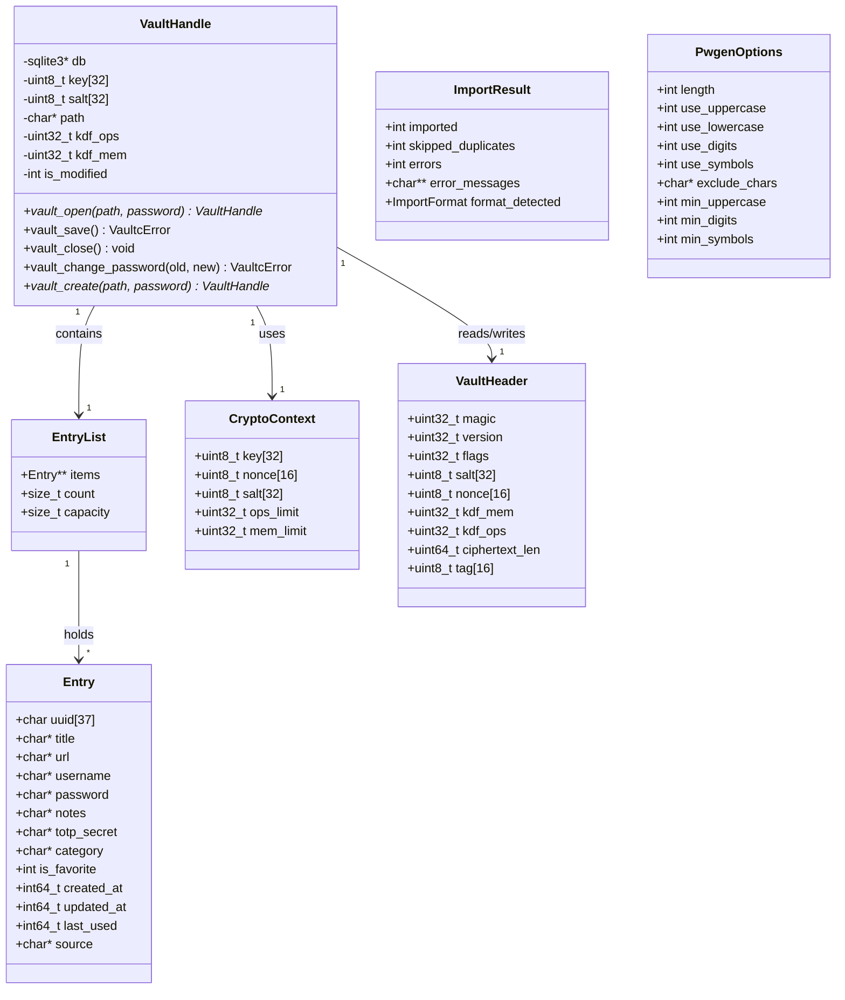
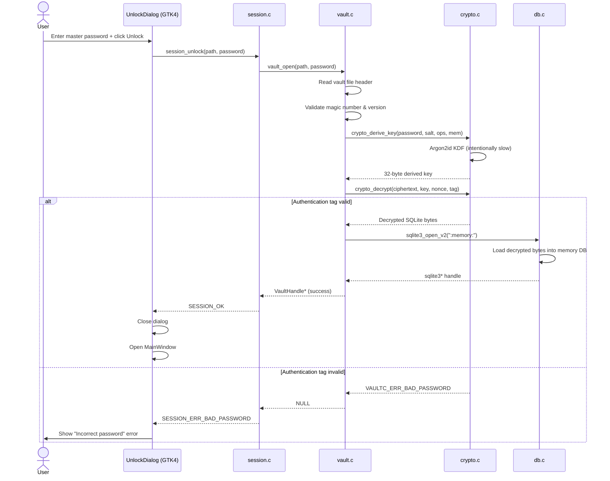
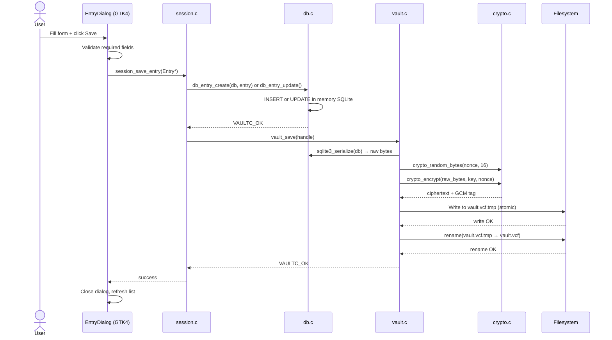
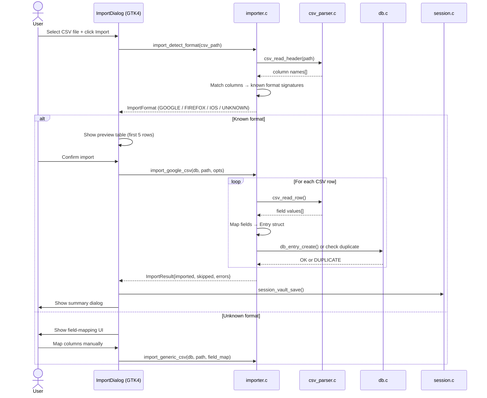
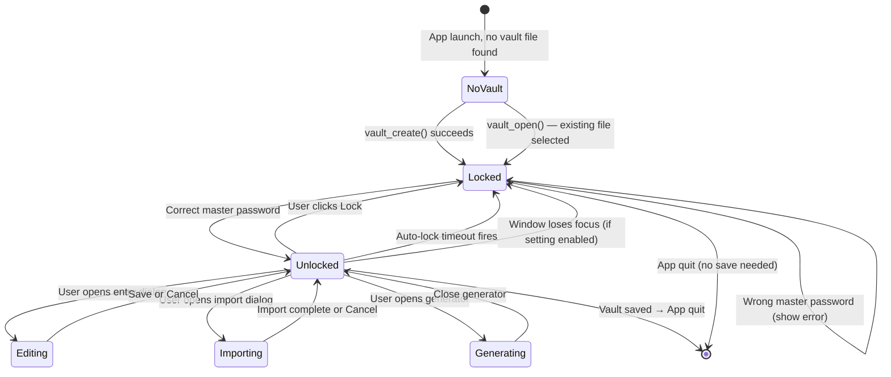
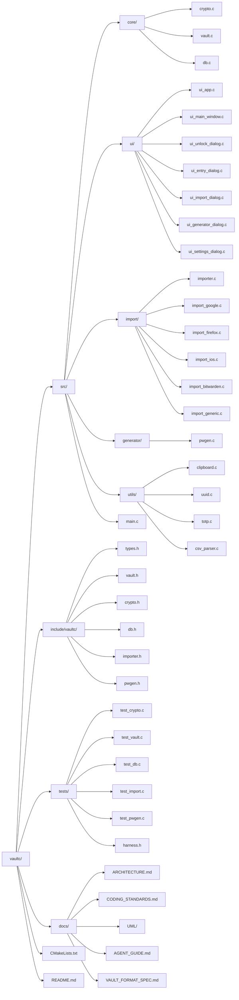

# VaultC — UML Diagrams

All diagrams use Mermaid syntax and can be rendered at https://mermaid.live

---

## 1. Module Dependency Diagram (Component View)

---

## 2. Class Diagram (Core Data Structures)

---

## 3. Sequence Diagram — Vault Unlock Flow

---

## 4. Sequence Diagram — Save Entry Flow

---

## 5. Sequence Diagram — CSV Import Flow

---

## 6. State Machine — Application Session State

---

## 7. File Structure Tree

